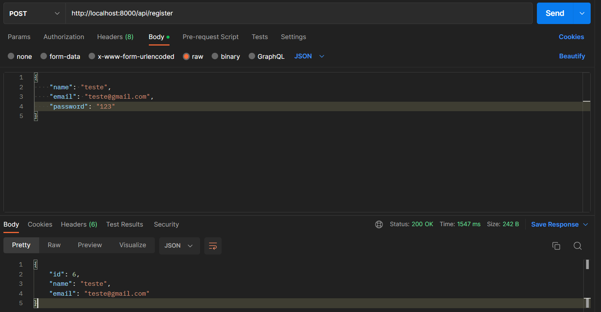
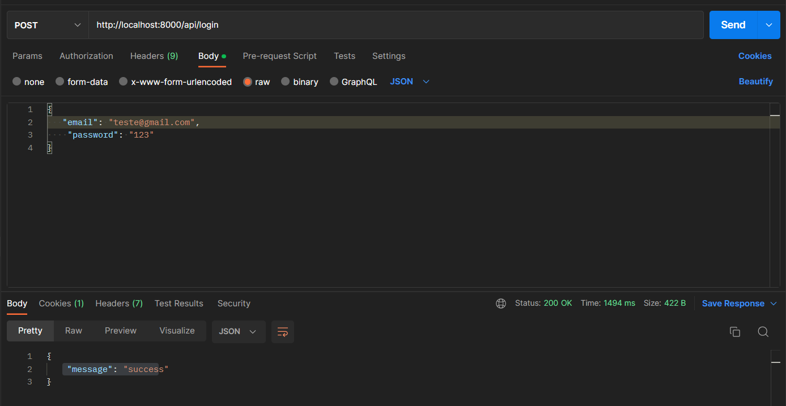
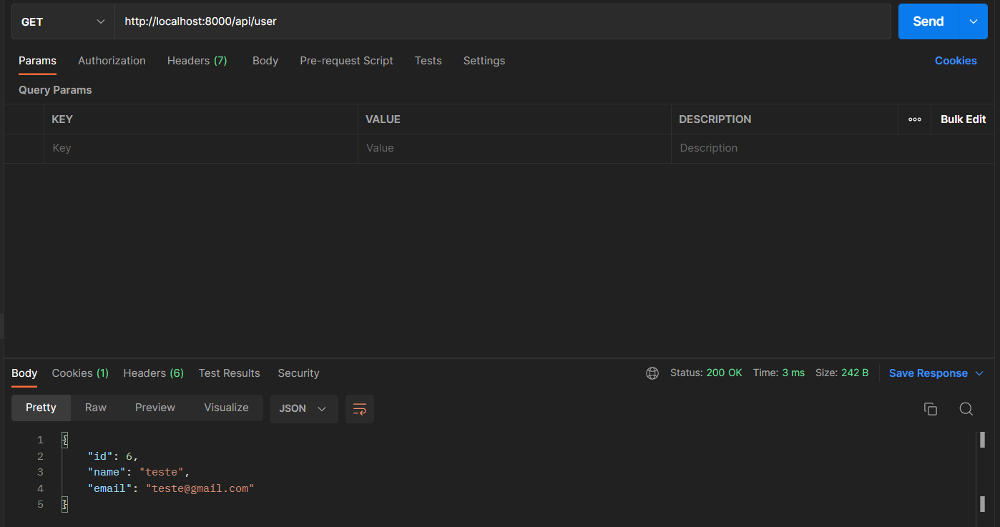

# Authentication with JWT and GO 

## Functionality:
- [x] User creation
- [x] User login
- [x] Check which user is logged in
- [x] Log out user

## API made using:
>GO

>FIBER

>GORM

>SQL

>JWT

## Install and Run

```
git clone https://github.com/guilherm5/APILogin-Golang-.git 
```

```
go get -u github.com/gofiber/fiber/v2
```
```
go get -u gorm.io/gorm
```
```
go get -u gorm.io/gorm
```
```
go run main.go
```

## Routes 
```
localhost:8000/api/register
```

```
localhost:8000/api/login
```

```
localhost:8000/api/user
```

```
localhost:8000/api/logout
```
## This application makes use of fiber to create routes, and jwt to authenticate and login with users.Below are some images for demonstration.

```
Register user
```


```
Login user
```


```
Get logged in user
```



```
Log out user
```


# Explanation

- the user is registered in a mysql database, his password is passed encrypted by bcrypt, so only the customer will have access to the password. After registration, we login the user, and in this case the JWT token is passed in the Cookie of the application, so that we have control of who is logged in, to log out the user and for more security as well (and for possible front end consumption)


